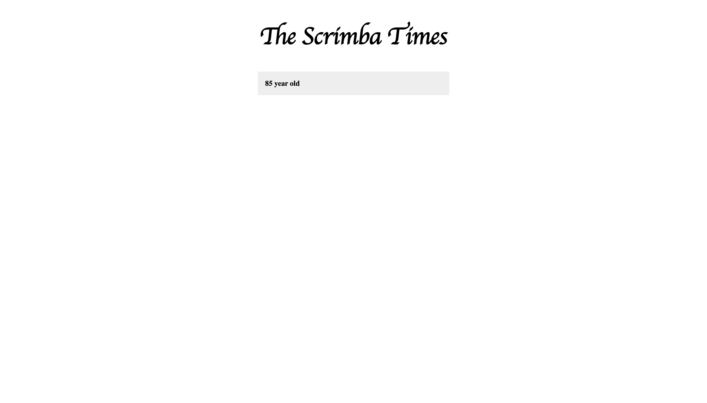

# The Scrimba Times

## Description

The Scrimba Times is a web application that allows users to view and manage news stories stored in a Firebase Realtime Database. Users can dynamically see the latest stories and remove them with a double-click.

## Features

- Displays a list of news stories retrieved from Firebase.
- Automatically updates the stories list in real-time when new stories are added.
- Allows users to remove stories by double-clicking on them.

## Visual Design

Below is a visual representation of the website page:



## Getting Started

### Prerequisites

- A web browser to view the application.
- Basic knowledge of HTML, CSS, and JavaScript.

### Installation

1. Clone this repository to your local machine using:

```bash
git clone https://github.com/BhoomiGohil/Scrimba-JavaScriptCourseLastestNews.git
```

2. **Navigate to the project directory:**

```bash
cd Scrimba-JavaScriptCourseLastestNews
```

3. **Open the `index.html` file in your web browser.**

```bash
open index.html
```

OR

3. **Open the project using Live Server:**

If you're using Visual Studio Code, install the Live Server extension.
Click on the "Go Live" option to run the project.

**Note:** This project requires a Firebase Database to store and retrieve data. Please set up a Firebase project and update the `databaseURL` in the JavaScript code accordingly.

## Usage

- Once the application is open, you will see the title "The Scrimba Times" and a list of news stories (if available).
- The stories list will update automatically when new entries are added to the Firebase database.
- Double-click on a story to remove it from the database and the displayed list.

## Technologies Used

- **HTML**: Structure of the web application.
- **CSS**: Styling of the application (see `index.css` for styles).
- **JavaScript**: Functionality and interaction with Firebase (see `index.js`).
- **Firebase**: Backend service for storing and retrieving news story data.

## Resources

Feel free to explore the code. Happy coding!
